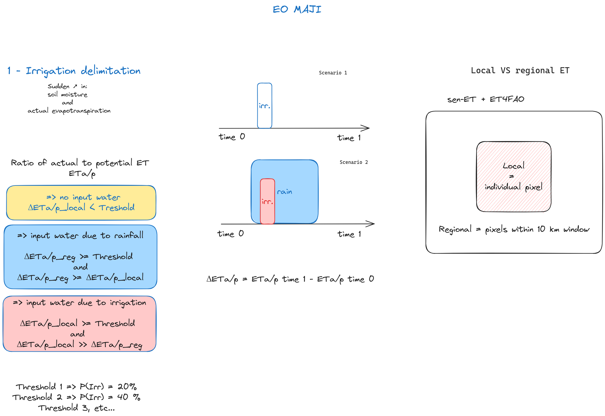
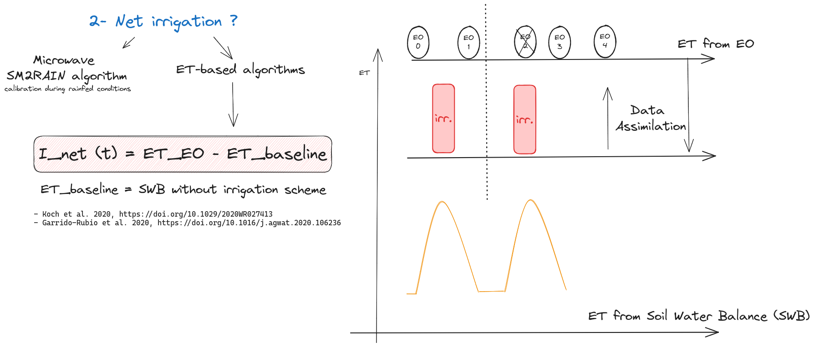

# EOMAJI
This project aims to implement a prototype for irrigation mapping and crop yield estimation using inputs from the scientific ECOSTRESS and PRISMA missions.

> **Hypothesis**: Irrigated agricultural areas can be distinguished from adjacent agricultural parcels or natural areas through sudden increase in soil moisture and actual evapotranspiration which cannot be explained by
other factors (e.g. change in weather or vegetation cover).

> **Note**
> This project aims to implement a prototype that applies the TSEB model evaluated under Sen-ET with inputs from the scientific ECOSTRESS and PRISMA missions as an exploration of the capabilities for future operational Copernicus missions (LSTM+CHIME) to estimate ET

**People**
- CSIC (H. Nieto, M. P. Martín, V. Burchard)
- DHI (R. Guzinski,M. Munk)
- University of Leicester (D. Ghent)

## Test field sites
- Burkina Faso
- Botswana

The datasets are accessible in the OSF: https://osf.io/zxuy5/

## Inputs EO-based ET models
- Sentinel-2 and Sentinel-3 satellites

### New satellite missions

- [ECOSTRESS](https://ecostress.jpl.nasa.gov/) thermal sensor: can provide robust measurements of Land Surface Temperature at high spatial and temporal resolutions
- [PRISMA hyperspectral sensor](https://www.eoportal.org/satellite-missions/prisma-hyperspectral): data for accurate modelling of such biophysical parameters as fractions of green and woody/senescent vegetation broadband albedo or leaf area index
- [Copernicus Sentinel Expansion missions](https://www.esa.int/Applications/Observing_the_Earth/Copernicus/Copernicus_Sentinel_Expansion_missions) - LSTM and CHIME

## Irrigation delineation

## Net irrigation estimation

