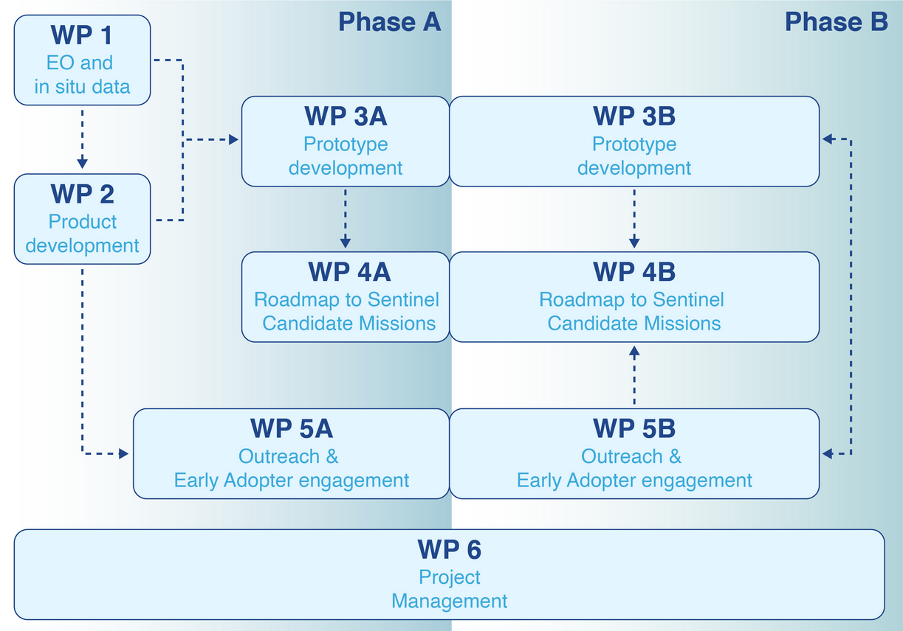

# Activitites
The proposed novel algorithms and prototypes to be developed in this project will take advantage of results and methods developed in recent ESA projects such as Sentinels for Evapotranspiration [Sen-ET](https://www.esa-sen4et.org/) and [ET4FAO](https://et4fao.dhigroup.com/#/). The Sen-ET approach estimates ET by exploiting the synergies between the high resolution Sentinel-2 multispectral sensor (20m, 5-day overpass) with the high revisit time of Sentinel-3’s thermal infrared sensor (1000m, ~daily overpass), in addition to meteorological from the Copernicus Climate Data. The developed algorithms were shown to be robust in a wide range of landscapes and conditions, including delivering products at scales suitable for agronomic monitoring and applications. These methods were subsequently applied within the [ET4FAO project](https://et4fao.dhigroup.com/#/) to produce national level dekadal ET maps at spatial scales ranging from 20 to 300m for Tunisia and Lebanon, further demonstrating the suitability of the Sen-ET approach to support large-scale agricultural and irrigation activities through Earth observation data. This project aims to implement a prototype that applies the TSEB model evaluated under Sen-ET with inputs from the scientific ECOSTRESS and PRISMA missions as an exploration of the capabilities for future operational Copernicus missions (LSTM+CHIME) to estimate ET. In addition, this project will investigate the potential of PRISMA hyperspectral observations to improve crop yield/biomass estimations to support agricultural monitoring. This will also complement the ET retrievals, acquiring a better understanding of water use efficiency (WUE) of cultivated landscapes. The final aim is to develop workflows, in collaboration with the African Early Adopters and EO partner(s), that support African irrigation and food security management and transfer these R&D learnings and results to African end-users and stakeholders.

